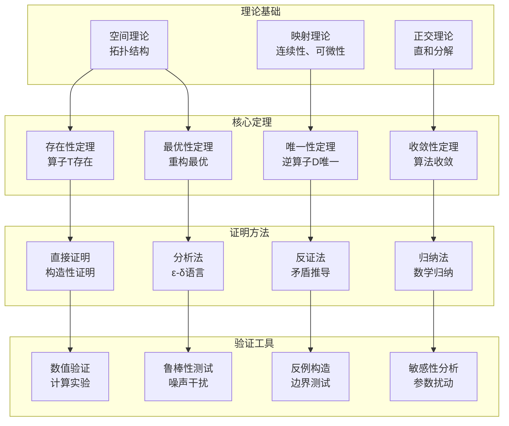
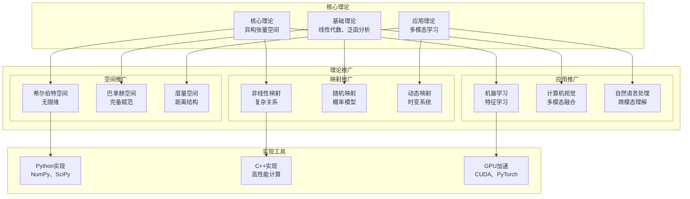

# 异构张量空间理论系统架构

## 整体架构概览

```mermaid
graph TB
    subgraph "输入空间"
        A[语义向量空间 A<br/>R^(1×n)]
        B[声学张量空间 B<br/>R^(1×K×V)]
    end
    
    subgraph "核心理论模块"
        T[正交嵌入算子 T<br/>T: R^(1×n) × R^(1×K×V) → R^(1×c)]
        D[逆分解算子 D<br/>D: R^(1×c) → R^(1×n) × R^(1×K×V)]
    end
    
    subgraph "统一目标空间"
        C[统一空间 C<br/>R^(1×c)]
        SA[子空间 SA]
        SB[子空间 SB]
    end
    
    subgraph "三大公理"
        O[正交性<br/>SA ⊥ SB]
        S[可分性<br/>C = φ(A) + ψ(B)]
        I[可逆性<br/>A = DA(ProjSA(C))<br/>B = DB(ProjSB(C))]
    end
    
    A --> T
    B --> T
    T --> C
    C --> SA
    C --> SB
    SA --> D
    SB --> D
    D --> A
    D --> B
    
    O -.-> C
    S -.-> T
    I -.-> D
```

## 核心算子详细架构

### 正交嵌入算子 T 的内部结构

```mermaid
graph LR
    subgraph "算子T内部"
        A_in[输入A<br/>R^(1×n)]
        B_in[输入B<br/>R^(1×K×V)]
        
        subgraph "流派1: 参数化正交矩阵"
            P1[反对称矩阵X<br/>X = -X^T]
            C1[Cayley变换<br/>Q = (I-X)(I+X)^-1]
            E1[指数映射<br/>Q = Exp(X)]
        end
        
        subgraph "流派2: 统计对齐(CCA)"
            C2[协方差计算<br/>ΣAA, ΣBB, ΣAB]
            S2[SVD分解<br/>特征值问题]
            A2[对齐变换<br/>最大化相关性]
        end
        
        subgraph "流派3: 对比学习"
            L[InfoNCE损失<br/>互信息最大化]
            M[对比映射<br/>语义互补]
            O3[优化目标<br/>min L]
        end
        
        subgraph "正交性保证"
            O1[正交约束<br/>Q^T Q = I]
            V[正交性验证]
            C[约束优化]
        end
        
        A_in --> P1
        A_in --> C2
        A_in --> L
        B_in --> P1
        B_in --> C2
        B_in --> L
        
        P1 --> O1
        C2 --> O1
        L --> O1
        
        O1 --> V
        V --> C
        C --> C_out[输出C<br/>R^(1×c)]
    end
```

### 逆分解算子 D 的内部结构

```mermaid
graph LR
    subgraph "算子D内部"
        C_in[输入C<br/>R^(1×c)]
        
        subgraph "空间投影"
            PA[正交投影到SA<br/>ProjSA(C)]
            PB[正交投影到SB<br/>ProjSB(C)]
        end
        
        subgraph "子空间分离"
            SA_sub[子空间SA<br/>语义特征]
            SB_sub[子空间SB<br/>声学特征]
        end
        
        subgraph "重构算法"
            DA[重构A<br/>DA = ProjSA(C)]
            DB[重构B<br/>DB = Flatten^-1(ProjSB(C))]
        end
        
        subgraph "误差分析"
            EA[重构误差A<br/>||DA(C) - A||^2]
            EB[重构误差B<br/>||DB(C) - B||^2]
            ET[总误差<br/>EA + EB]
        end
        
        C_in --> PA
        C_in --> PB
        
        PA --> SA_sub
        PB --> SB_sub
        
        SA_sub --> DA
        SB_sub --> DB
        
        DA --> EA
        DB --> EB
        EA --> ET
        EB --> ET
        
        DA --> A_out[输出A<br/>R^(1×n)]
        DB --> B_out[输出B<br/>R^(1×K×V)]
    end
```

## 理论验证架构

### 数学证明流程



## 实验验证架构

### 数值实验设计

```mermaid
graph TB
    subgraph "实验设计"
        ED[实验设计]
        DG[数据生成]
        EV[实验验证]
        EA[实验分析]
    end
    
    subgraph "数据生成"
        S1[合成数据<br/>已知分布]
        S2[随机数据<br/>统计特性]
        S3[边界数据<br/>极端情况]
        S4[噪声数据<br/>鲁棒性测试]
    end
    
    subgraph "验证指标"
        M1[正交性误差<br/>||Q^T Q - I||]
        M2[重构误差<br/>||D(T(A,B)) - (A,B)||]
        M3[序列保持性<br/>拓扑序保持]
        M4[计算复杂度<br/>时间/空间复杂度]
    end
    
    subgraph "分析方法"
        A1[统计分析<br/>均值、方差]
        A2[收敛分析<br/>收敛速度]
        A3[敏感性分析<br/>参数影响]
        A4[比较分析<br/>方法对比]
    end
    
    ED --> DG
    DG --> S1
    DG --> S2
    DG --> S3
    DG --> S4
    
    S1 --> EV
    S2 --> EV
    S3 --> EV
    S4 --> EV
    
    EV --> M1
    EV --> M2
    EV --> M3
    EV --> M4
    
    M1 --> EA
    M2 --> EA
    M3 --> EA
    M4 --> EA
    
    EA --> A1
    EA --> A2
    EA --> A3
    EA --> A4
```

## 优化方法架构

### 约束优化框架

```mermaid
graph LR
    subgraph "优化问题"
        OBJ[目标函数<br/>min f(Q)]
        CON[约束条件<br/>Q^T Q = I]
        VAR[优化变量<br/>Q ∈ Stiefel]
    end
    
    subgraph "优化方法"
        subgraph "流形优化"
            RG[黎曼梯度<br/>∇_R f]
            RC[黎曼共轭梯度<br/>CG方法]
            RTR[黎曼信赖域<br/>Trust Region]
        end
        
        subgraph "参数化优化"
            CAY[Cayley参数化<br/>Q = (I-X)(I+X)^-1]
            EXP[指数映射<br/>Q = Exp(X)]
            QR[QR分解参数化]
        end
        
        subgraph "惩罚函数法"
            LAG[拉格朗日乘数<br/>L = f + λ||Q^T Q - I||]
            PEN[惩罚函数<br/>P = f + μ||Q^T Q - I||^2]
            AUG[增广拉格朗日<br/>AL = f + λ||Q^T Q - I|| + μ/2||Q^T Q - I||^2]
        end
    end
    
    subgraph "收敛性分析"
        CONV[收敛性证明]
        RATE[收敛速度分析]
        STAB[数值稳定性]
        COMP[计算复杂度]
    end
    
    OBJ --> RG
    OBJ --> CAY
    OBJ --> LAG
    
    CON --> RG
    CON --> CAY
    CON --> LAG
    
    VAR --> RG
    VAR --> CAY
    VAR --> LAG
    
    RG --> CONV
    CAY --> CONV
    LAG --> CONV
    
    CONV --> RATE
    CONV --> STAB
    CONV --> COMP
```

## 理论应用架构

### 理论推广框架



## 系统特点总结

### 核心特点
1. **理论严谨性**: 基于严格的数学推导和证明
2. **方法多样性**: 三种不同数学原理的实现流派
3. **通用性**: 可推广到多种异构空间映射问题
4. **可验证性**: 完整的数值验证和实验框架

### 技术优势
1. **正交性保证**: 严格的正交约束和验证机制
2. **可逆性**: 理论保证的无损或低损重构
3. **序列保持**: 维持时间序列的拓扑结构
4. **优化效率**: 多种高效的约束优化方法

### 应用前景
1. **多模态学习**: 跨模态特征对齐和融合
2. **表示学习**: 异构特征的统一表示
3. **信号处理**: 多维信号的压缩和重构
4. **数据科学**: 异构数据的分析和挖掘

这个系统架构为异构张量空间的理论研究提供了完整的框架，确保了理论的严谨性和实现的可行性。